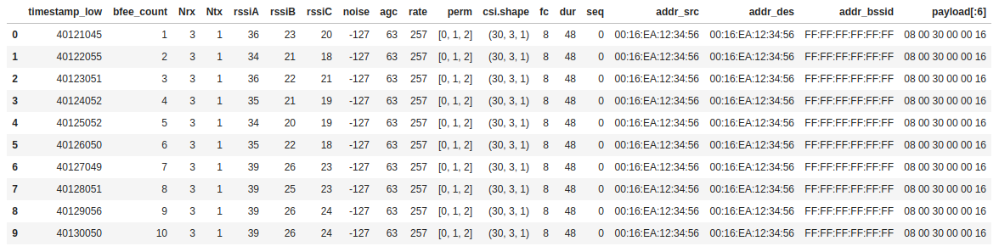
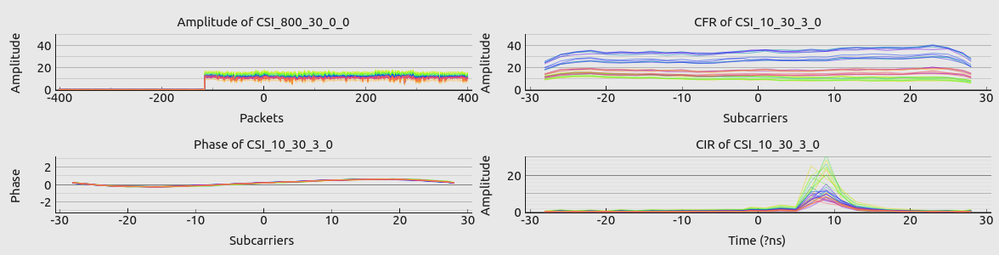

# csiread

Parse channel state information from raw CSI data file in Python.

- Full support for [Linux 802.11n CSI Tool](https://dhalperi.github.io/linux-80211n-csitool/) and [Atheros CSI Tool](https://wands.sg/research/wifi/AtherosCSI/), partial support for [nexmon_csi](https://github.com/seemoo-lab/nexmon_csi)
- At least 15 times faster than the implementation in Matlab
- Real-time parsing

## Install

```bash
cd csiread
pip3 install -r requirements.txt
python3 setup.py sdist bdist_wheel
pip3 install -U dist/csiread*.whl
```

## Usage

```python
import csiread

# Linux 802.11n CSI Tool
csifile = "../material/5300/dataset/sample_0x1_ap.dat"
csidata = csiread.Intel(csifile, Nrxnum=3, Ntxnum=2, pl_size=10)
csidata.read()
csi = csidata.get_scaled_csi()
print(csidata.csi.shape)

# Atheros CSI Tool
csifile = "../material/atheros/dataset/ath_csi_1.dat"
csidata = csiread.Atheros(csifile, Nrxnum=3, Ntxnum=2, pl_size=10, Tones=56)
csidata.read(endian='little')
print(csidata.csi.shape)

# nexmon_csi
csifile = "../material/nexmon/dataset/example.pcap"
csidata = csiread.Nexmon(csifile, chip='4358', bw=80)
csidata.read()
print(csidata.csi.shape)
```

Both Intel.payload and Atheros.payload are MPDU. [scapy](https://scapy.net) can parse it easily. For convenience, csiread.Intel can parse the specified MAC header.

Read `example/*.py` and `csiread/csiread.pyx` for more details.

<center><b>contents of packets</b></center>



<center><b>real-time plotting</b></center>



## Log

### v1.3.5

1. new feature: add support for nexmon_csi
2. new feature: rename csiread.CSI to csiread.Intel

### v1.3.4

1. new feature: process data faster
2. new feature: add in-place operation in csiread.CSI
3. new feature: add CSI.pmsg() and Atheros.pmsg() to parse message in real time.
4. new feature: both CSI.payload and Atheros.payload are MPDU and stored in np.uint8 now.
5. fix bug: noise will change after calling get_scaled_csi()
6. fix bug: in matlab, read_log_file drops the last two packets(Atheros), but here we keep them.
7. fix bug: get_scaled_csi_sm() value error.
8. fix bug: csiread.CSI may not work well on big-endian computers.
9. new examples: plot CSI in real time
10. new example: implement log_to_file in pure Python
11. new example: a better solution to the MemoryError

### v1.3.3

1. update examples
2. new feature: add `__getitem__`
3. new feature: add get_scaled_csi_sm(), apply_sm()

### v1.3.2

1. fix bug: choose big endian or little endian when using Atheros, e.g. csidata.read(endian='big')

### v1.3.1

1. fix bug: some value error on 32-bit computer
2. fix bug: avoid built-in keyword, len -> lens
3. new example: add `example/csishow.py` to plot data
4. new example: add `example/csisplit.py` to split the data file of linux-80211n-tool into small pieces

### v1.3.0

1. fix bug: report format error
2. fix bug: `count` value error
3. new feature: add support for atheros
4. new feature: add processing functions of intel 5300: get_scaled_csi(), get_total_rss()
5. new example
