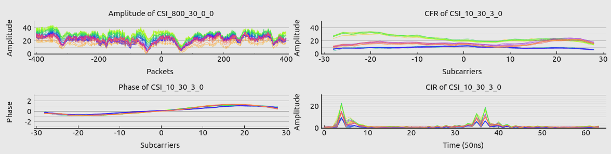

# csiread [](https://pypi.org/project/csiread/)

A fast channel state information parser for Intel, Atheros, Nexmon and ESP32 in Python.

- Full support for [Linux 802.11n CSI Tool](https://dhalperi.github.io/linux-80211n-csitool/), [Atheros CSI Tool](https://wands.sg/research/wifi/AtherosCSI/), [nexmon_csi](https://github.com/seemoo-lab/nexmon_csi) and [ESP32-CSI-Tool](https://github.com/StevenMHernandez/ESP32-CSI-Tool)
- At least 15 times faster than the implementation in Matlab
- Real-time parsing and visualization.

<center><b>real-time plotting</b></center>



## Install

```bash
pip3 install csiread
```

## Quickstart

```python
import csiread

# Linux 802.11n CSI Tool
csifile = "../material/5300/dataset/sample_0x1_ap.dat"
csidata = csiread.Intel(csifile, nrxnum=3, ntxnum=2, pl_size=10)
csidata.read()
csi = csidata.get_scaled_csi()
print(csidata.csi.shape)

# Atheros CSI Tool
csifile = "../material/atheros/dataset/ath_csi_1.dat"
csidata = csiread.Atheros(csifile, nrxnum=3, ntxnum=2, pl_size=10, tones=56)
csidata.read(endian='little')
print(csidata.csi.shape)

# nexmon_csi
csifile = "../material/nexmon/dataset/example.pcap"
csidata = csiread.Nexmon(csifile, chip='4358', bw=80)
csidata.read()
print(csidata.csi.shape)

# ESP32-CSI-Tool
csifile = "../material/esp32/dataset/example_csi.csv"
csidata = csiread.ESP32(csifile, csi_only=True)
csidata.read()
print(csidata.csi.shape)
```
